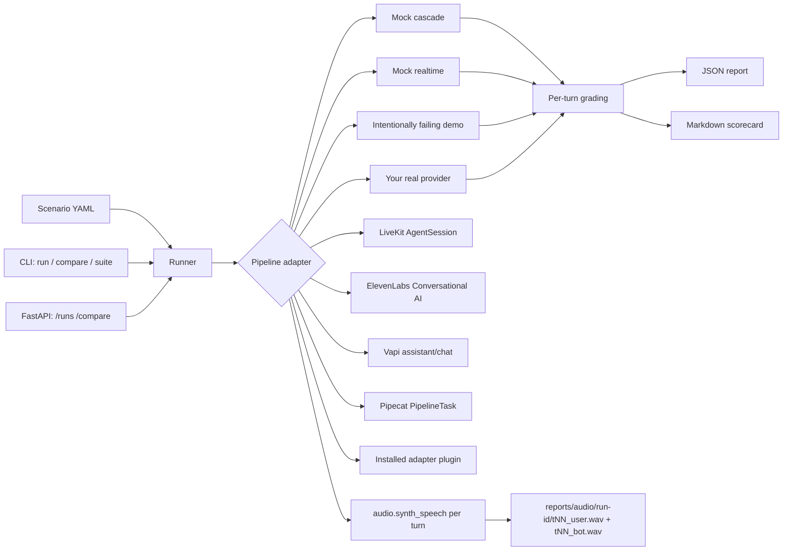

# Voice Eval — a simulation module for voice AI pipelines

[](https://github.com/rand0wn/voice-eval/actions/workflows/ci.yml)
[](https://www.python.org/downloads/)
[](LICENSE)

Run scripted, multi-turn conversations through one or more voice-agent
pipelines and get back a graded scorecard *and* real per-turn audio, not just
a text diff. This is the same pattern used to validate a production voice
agent before every deploy: same script, every pipeline candidate, identical
grading rubric, latency percentiles instead of a single average.

The included `cascade`, `realtime`, and intentionally failing `degraded`
adapters are deterministic mocks — no API keys, network access, telephony, or
microphone required to see the full workflow, including audio generation. Swap
in one real adapter (or ten) and nothing else changes: the scenarios, grading,
CLI, and API are all provider-neutral.

> **Stop manually retesting your voice agent.**
> [Run your first repeatable evaluation](#quickstart), then connect your own
> pipeline and share what the scorecard catches.

**Ready to help?** Try a scenario, [open an issue](https://github.com/rand0wn/voice-eval/issues)
with your results, or read the [contribution guide](CONTRIBUTING.md) to add an
adapter, scenario, grading rule, or documentation improvement.

## What it does

- **Scripts conversations, not single prompts.** A scenario is a persona and
  an ordered list of turns — what the user says, which tools the agent is
  expected to call, phrases the response must contain.
- **Grades every turn against a fixed rubric**, not just "did it respond":
  expected-tool recall, required content, question/sentence-count limits,
  latency budget, non-empty transcript — and reports *which specific rule*
  failed on which turn, not a single pass/fail blob.
- **Captures playable audio artifacts per turn.** Every simulated turn can
  write a valid WAV file for both sides. The offline synthesizer uses
  deterministic tones; replace its small interface with real TTS or captured
  provider audio when evaluating speech quality.
- **Drives and grades native speech-to-speech pipelines.** `--audio-mode s2s`
  synthesizes each turn to audio, sends it into the adapter, and grades the
  pipeline's returned audio directly — for providers (OpenAI Realtime,
  ElevenLabs Conversational AI, and similar) that never expose intermediate
  text. See [S2S testing](docs/s2s-testing.md).
- **Compares pipelines head-to-head.** Run the identical scenario through
  every adapter you have and get a side-by-side table: overall score,
  average/P95 latency, tool recall — the numbers you need before choosing an
  architecture, not after.
- **Runs the whole scenario suite as a CI gate.** Set minimum score/tool-recall
  and maximum P95 thresholds; a regression writes its diagnostic report and
  exits non-zero.
- **Ships as both a CLI and a FastAPI service**, so it drops into a terminal
  workflow or a CI job equally well.

## Quickstart

Requires Python 3.10+.

Clone the repository and install the CLI in an isolated environment:

```bash
git clone https://github.com/rand0wn/voice-eval.git
cd voice-eval
python3.12 -m venv .venv
source .venv/bin/activate
python -m pip install -e ".[dev]"
```

On Windows, use PowerShell instead of `source .venv/bin/activate`:

```powershell
py -3.12 -m venv .venv
.\.venv\Scripts\Activate.ps1
python -m pip install -e ".[dev]"
```

See [docs/windows.md](docs/windows.md) for execution-policy notes and Windows-specific
troubleshooting.

Want to try it without cloning first? Install directly from GitHub:

```bash
python -m pip install "voice-agent-eval-lab @ git+https://github.com/rand0wn/voice-eval.git"
voice-eval run --scenario basic_booking --adapter cascade
```

The project is being prepared for its first PyPI release. The GitHub install
above is the current stable public installation path.

Run one scenario through one pipeline:

```bash
voice-eval run --scenario basic_booking --adapter cascade
```

```text
# Voice evaluation: basic_booking
- Overall: 100.00%
- Average latency: 640.0 ms (P50 640.0 ms, P95 640.0 ms)
- Tool recall: 100.00%
...
```

Add `--audio` to also synthesize a WAV file per turn under `reports/audio/<run-id>/`:

```bash
voice-eval run --scenario priya_reschedule --adapter cascade --audio
```

Or drive the scenario with synthesized user audio and grade the pipeline's
*returned* audio directly, using the offline `mock-s2s` demo adapter (audio is
always written in this mode):

```bash
voice-eval run --scenario basic_booking --adapter mock-s2s --audio-mode s2s
```

See [S2S testing](docs/s2s-testing.md) for the adapter contract and how to
connect a real native speech-to-speech pipeline.

See useful failures immediately by comparing the healthy cascade fixture with
the intentionally unreliable demo adapter:

```bash
voice-eval compare --scenario arjun_cancel --adapters cascade degraded
```

```text
| Adapter  | Overall | Avg latency (ms) | P95 latency (ms) | Tool recall |
|----------|---------|------------------|------------------|-------------|
| cascade  | 100.00% | 640.0            | 640.0            | 100.00%     |
| degraded | 55.27%  | 1450.0           | 1450.0           | 33.33%      |
```

Both commands write a JSON report (for automation) and a Markdown scorecard
(for humans) under `reports/`. See the committed
[example comparison](examples/reports/arjun_cancel_comparison.md).

`degraded` is a demonstration fixture, not a result from any real provider.
It deliberately misses tools, omits required content, exceeds response-shape
limits, and breaches the latency budget.

Run every bundled scenario and make the command fail when a release candidate
misses the required quality or latency bar:

```bash
voice-eval suite \
  --adapter cascade \
  --min-score 0.90 \
  --min-tool-recall 1.0 \
  --max-p95-ms 900
```

The same gates work with `run` and `compare`. Reports are written before a
failed gate exits with status `1`, so the CI job retains useful diagnostics.

Run the complete terminal walkthrough locally with:

```bash
scripts/demo.sh
```

Or replay the committed, under-30-second terminal recording after installing
[`asciinema`](https://asciinema.org/):

```bash
asciinema play docs/voice-eval-demo.cast
```

Regenerate it with `scripts/record-demo.sh` whenever the CLI output changes.

## Run the API

```bash
uvicorn voice_agent_eval_lab.api:app --reload
```

Open <http://127.0.0.1:8000/docs> for the interactive API.

```bash
# List available scenarios
curl http://127.0.0.1:8000/scenarios

# Run one scenario through one adapter
curl -X POST http://127.0.0.1:8000/runs \
  -H "content-type: application/json" \
  -d '{"scenario":"basic_booking","adapter":"cascade"}'

curl http://127.0.0.1:8000/runs/YOUR_RUN_ID

# Compare adapters on the same scenario
curl -X POST http://127.0.0.1:8000/compare \
  -H "content-type: application/json" \
  -d '{"scenario":"arjun_cancel","adapters":["cascade","realtime"]}'

curl http://127.0.0.1:8000/compare/YOUR_COMPARE_ID
```

Environment variables:

| Variable | Default | Purpose |
|---|---|---|
| `VOICE_EVAL_REPORT_DIR` | `reports` | Where JSON/Markdown reports (and audio, if enabled) are written |
| `VOICE_EVAL_AUDIO` | unset | Set to `1` to synthesize per-turn WAV files on every API run/compare |

## Developer guide

### Project layout

```
src/voice_agent_eval_lab/
  models.py      # Scenario, Turn, TurnResult, TurnGrade, Evaluation, API request/response schemas
  audio.py        # deterministic WAV synthesis — swap for a real TTS call
  adapters.py     # adapter contract, built-ins, registration, and plugin discovery
  livekit_adapter.py # LiveKit AgentSession event collector + evaluation adapter
  s2s.py          # native speech-to-speech extension point (S2STurnObservation, S2SPipelineAdapter, mock-s2s)
  elevenlabs_adapter.py # ElevenLabs Conversational AI WebSocket event collector + evaluation adapter
  vapi_adapter.py # Vapi assistant/chat client + evaluation adapter
  pipecat_adapter.py # Pipecat PipelineTask client protocol + evaluation adapter
  grading.py      # per-turn rule grading + aggregate scoring
  runner.py       # orchestrates: load scenario -> run adapter(s) -> grade -> write reports
  scenarios.py    # YAML loading
  cli.py          # `voice-eval run` / `voice-eval compare` / `voice-eval suite`
  api.py          # FastAPI: /runs, /compare, /scenarios, /health
scenarios/        # YAML conversation scripts
tests/            # one test module per source module above
```

### Add a scenario

Create a YAML file in `scenarios/`:

```yaml
id: my_scenario
title: Human-readable title
description: What this scenario exercises and why.
persona: some_persona_name
max_latency_ms: 900          # per-turn latency budget
max_questions_per_turn: 1    # grading rule: at most N "?" per response
max_sentences_per_turn: 3    # grading rule: at most N sentences per response
turns:
  - user: "What the caller says."
    expected_tools: [tool_name]   # tools the agent must call this turn (can be empty)
    must_include: [phrase]        # substrings the response must contain (can be empty)
  - user: "..."
    expected_tools: []
    must_include: []
```

Write multi-turn, multi-persona scenarios (see `priya_reschedule.yaml` and
`arjun_cancel.yaml`) to exercise state across turns — a real agent's biggest
failures usually show up on turn 3+, not turn 1. Keep every scenario
synthetic: never commit real customer transcripts, phone numbers, prompts, or
API keys.

### Connect a real pipeline

Implement `VoicePipelineAdapter.execute` in `src/voice_agent_eval_lab/adapters.py`:

```python
class MyRealAdapter(VoicePipelineAdapter):
    name = "my_provider"

    def execute(self, scenario: Scenario, audio_dir: Path | None = None) -> list[TurnResult]:
        # For each turn: call your STT/LLM/TTS or speech-to-speech pipeline,
        # measure latency, collect tool calls, and — if audio_dir is set —
        # save the real synthesized audio there instead of the mock tone.
        ...
```

Register it from application code with
`register_adapter("my-provider", MyRealAdapter)`, or publish it as a Python
entry-point plugin so users only need to install your package. Nothing in
`grading.py`, `runner.py`, the CLI, or the API needs to change — they only
depend on the `TurnResult` contract. See the
[adapter plugin guide](docs/adapter-plugins.md).

### Connect LiveKit

Install the optional integration dependency:

```bash
python -m pip install -e ".[dev,livekit]"
```

Attach `LiveKitEventCollector` to the `AgentSession` your application already
owns, then expose a small turn-client factory through
`VOICE_EVAL_LIVEKIT_CLIENT`. The adapter records final transcripts, executed
tools, end-to-end latency, available LLM/TTS component timings, and session
metadata. It intentionally does not claim audio export or interruption
simulation. See the [LiveKit adapter guide](docs/livekit.md).

### Connect ElevenLabs Conversational AI

Install the optional integration dependency:

```bash
python -m pip install -e ".[dev,elevenlabs]"
```

Set `ELEVENLABS_API_KEY` and `ELEVENLABS_AGENT_ID` for an existing
Conversational AI agent, or inject your own client via
`VOICE_EVAL_ELEVENLABS_CLIENT`. The adapter drives the agent's WebSocket API,
recording transcripts, client tool calls, and — when the session streams
`audio` events — the agent's real synthesized audio. See the
[ElevenLabs adapter guide](docs/elevenlabs.md).

### Connect Vapi

No optional dependency is required; the real client uses only the standard
library. Set `VAPI_API_KEY` and `VAPI_ASSISTANT_ID`, or expose a turn-client
factory through `VOICE_EVAL_VAPI_CLIENT` if you want to drive Vapi's `/call`
REST API and websocket/webhook event stream yourself. Missing credentials
raise a clear error instead of a stack trace. See the
[Vapi adapter guide](docs/vapi.md).

### Connect Pipecat

Pipecat is a self-hosted framework rather than a hosted API: your application
composes its own STT/LLM/TTS services into a `Pipeline`/`PipelineTask`. Wrap
that pipeline in a small client implementing `PipecatTurnClient.run_turn`,
then expose a zero-argument factory through `VOICE_EVAL_PIPECAT_CLIENT`. The
adapter has no required dependency on `pipecat-ai` itself — install it only
if your own client code needs it:

```bash
python -m pip install -e ".[dev,pipecat]"
```

The adapter records final transcripts, executed tools, end-to-end latency,
available per-processor component timings, and session metadata. It
intentionally does not claim audio export. See the
[Pipecat adapter guide](docs/pipecat.md).

For trustworthy comparisons across real providers:

1. Run identical scenarios against every provider being compared.
2. Separate tool-execution time from conversational latency in your own
   adapter (don't let a slow tool call masquerade as slow LLM/TTS).
3. Run each scenario multiple times and report percentiles, not a single
   average — a single run is not a measurement.
4. Keep provider/model version strings in the turn or run metadata so a
   regression can be traced to a specific model bump later.
5. Read the actual transcripts and listen to the actual audio before
   publishing a conclusion — an aggregate score can hide a single
   catastrophic turn.

### Swap the audio synthesis for real TTS

`audio.synth_speech(text, path, voice)` in `src/voice_agent_eval_lab/audio.py`
is the only place audio gets generated. It's a deterministic tone-based
stand-in so the whole demo works offline. To hear real speech, replace its
body with a call to your TTS provider, keeping the same signature (text +
output path in, duration in milliseconds out) — the adapters and runner
don't need to know the difference.

### Test it

```bash
pytest -q
```

The suite covers audio synthesis, grading rules (including a deliberately
failing turn), scenario loading, the CLI-facing runner (single run, run with
audio, and cross-adapter compare), and the full API lifecycle.

```bash
docker build -t voice-eval .
docker run --rm -p 8000:8000 voice-eval
```

## How it fits together



## Use cases

- **Pre-deploy regression gate.** Run the fixed scenario suite against the
  candidate pipeline in CI before every deploy; block on a score drop or a
  new `FAIL` rule, the same way a unit-test suite blocks a broken build.
- **Vendor/architecture comparison.** Decide between a cascade (STT→LLM→TTS)
  and a native speech-to-speech pipeline — or between two STT/TTS vendors —
  using identical scripts and a shared rubric instead of anecdotal listening.
- **Latency budget enforcement.** Track P50/P95 per-turn latency over time
  and catch a prompt or model change that silently pushes response times
  past what's acceptable for a live caller.
- **Tool-calling reliability audits.** Verify an agent actually invokes the
  tools it's supposed to (booking, lookup, update) across longer, multi-turn
  conversations, where recall tends to degrade compared to a single-turn
  demo.
- **Onboarding new personas/scripts without a live agent.** Product or QA can
  write new YAML scenarios and see graded, audible results without needing a
  live phone call, a microphone, or provider credentials.
- **Portfolio/demo artifact.** A working, self-contained example of building
  evaluation infrastructure around a non-deterministic AI system — the kind
  of harness real voice AI teams build once call volume makes manual
  listening impractical.

### Real-world scenarios this pattern has actually caught

These are the concrete situations that motivated this harness on a
production Hindi-language voice agent — the same shape of problem shows up
on any voice AI pipeline:

- **A latency optimization that broke tool calls.** Reducing tool-adapter
  latency (moving DB writes to background tasks) shaved ~500ms off tool
  turns — but a naive before/after comparison on a single conversation
  would have missed that one WAIT-mode tool's timeout was now too close to
  the pipeline's hard function-call deadline. Running the full scripted
  suite caught the failure immediately as a new `expected_tools_called`
  failure on one specific turn, not a vague "feels slower sometimes."
- **Choosing cascade vs. speech-to-speech with real evidence, not a demo.**
  A native speech-to-speech model looked faster in a quick manual test, but
  scripted, graded runs across multiple personas showed it silently skipped
  tool calls on ~30% of turns that required them — a production blocker a
  single spot-check would never surface. The comparison table made the
  tradeoff (lower latency vs. broken tool recall) an explicit, numeric
  decision instead of a gut call.
- **Regression-testing a prompt or model change before it reaches a live
  caller.** Every prompt edit, model bump, or context-pruning change gets
  run through the same scenario suite first; a drop in per-turn grade score
  (not just "the demo still sounds fine") is the signal to fix it before
  merging, the same discipline a unit-test suite brings to a bug fix.
- **Catching response-shape drift across dozens of turns.** Rules like
  max-questions-per-turn and max-sentences-per-turn exist because an LLM
  will happily drift into asking two questions at once or writing a
  paragraph when a live caller needs one short spoken sentence — a defect
  that's invisible in a text transcript review but immediately audible (and
  now, immediately gradable) turn by turn.
- **Validating a new persona/script before a rollout without a live call.**
  Adding a new customer segment or conversation flow means writing the YAML
  script once and getting graded, audible output back in seconds — no need
  to book a real test call, find a Hindi/regional-language speaker, or wait
  for a QA cycle to find out the agent mishandles that flow.

## Troubleshooting

- `python` too old: use `python3.11` or `python3.12` when creating the venv.
- `voice-eval` not found: activate `.venv` and rerun the editable install.
- Scenario not found: pass its filename without `.yaml`, and keep it under
  `scenarios/`.
- Port 8000 occupied: add `--port 8001` to the `uvicorn` command.
- `.wav` files missing after `voice-eval run`: pass `--audio` (CLI) or set
  `VOICE_EVAL_AUDIO=1` (API) — audio synthesis is opt-in to keep the default
  run fast.

This is intentionally a simulation and grading core, not a full product — it
excludes telephony, authentication, billing, and a dashboard UI. It's the
evaluation layer you embed around whichever real voice pipeline you build or
buy.

## Contributing

Contributions are welcome, including small documentation fixes. The most useful
ways to help are:

- add a synthetic multi-turn scenario that exposes a real failure mode;
- connect another voice pipeline through a provider-neutral adapter;
- improve grading, reports, or CI integration;
- report a reproducible bug or share how the harness behaved on your pipeline.

Start with [CONTRIBUTING.md](CONTRIBUTING.md). It explains setup, tests, pull
requests, privacy expectations, and good first contributions.

## License

Apache-2.0. See [LICENSE](LICENSE).
